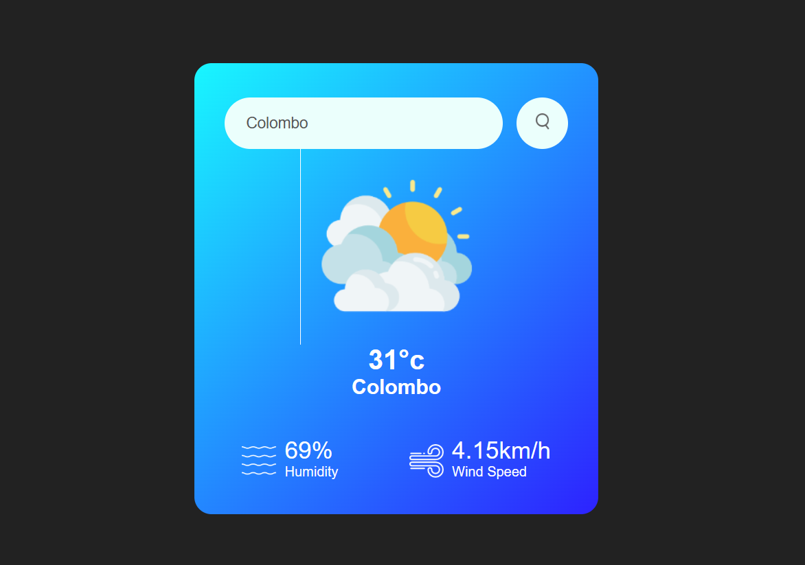

# Weather App 🌤️

A simple, responsive Weather App that allows users to search for any city and get the current weather, including temperature, humidity, wind speed, and weather condition icon. Built with **HTML**, **CSS**, and **JavaScript** using the **OpenWeatherMap API**.

---

## Features

- Search for weather by city name.
- Displays:
  - Temperature in Celsius.
  - Humidity percentage.
  - Wind speed.
  - Weather condition icon (Clouds, Clear, Rain, Drizzle, Mist).
- Handles invalid city names with a friendly error message.
- Responsive design for mobile and desktop.

---

## Demo

  

---

## Technologies Used

- HTML5
- CSS3
- JavaScript (ES6)
- [OpenWeatherMap API](https://openweathermap.org/api)

---

### 1. Live Link

https://dinulishamindi.github.io/weather-app/
